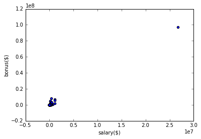
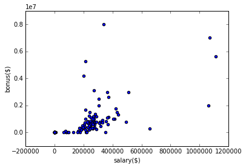
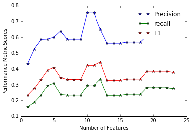

<center> <h1><b>Machine Learning: Identify Fraud From Enron Emails</b></h1> </center>


## Introduction

Enron was one of the largest energy companies in the United States in 2000 with claimed revenue of more than $100 Billions in that year. By 2002, it had collapsed into bankruptcy due to consequences of corporate fraud. As a result of federal investigation, a large amount of confidential data was entered into the public sphere including financial and email data.

The goal of this project is to identify POI(person of interest) that may have committed corporate fraud. We use machine learning techniques to look for insights into patterns in the data that could point to any involvement of the employees in suspicious activities as revealed by the financial and email data.

## Data Exploration and Preperation

Lets explore some relavant information about the data.


```python
from poi_id import * 
with open("final_project_dataset.pkl", "r") as data_file:
    d = pickle.load(data_file)
print "Number of people in the dataset =", len(d)
count=0
n=0
s=0
for person, value in d.iteritems():
    #print [0,'NaN'].count
    n+=([d[person][feature] for feature in FeaturesList(d)]).count('NaN')
    if d[person]['poi'] == True:
        count+=1
print "Number of Persons of Interest =", count  
print "Percentage of missing data =", round(n*100./(146*20),2), "%"  
print "Number of features(not counting 'email_address' as a feature) =", len(FeaturesList(d))
print "features list:" 
l=FeaturesList(d)
print l
```

    Number of people in the dataset = 146
    Number of Persons of Interest = 18
    Percentage of missing data = 45.31 %
    Number of features(not counting 'email_address' as a feature) = 20
    features list:
    ['poi', 'salary', 'to_messages', 'deferral_payments', 'total_payments', 'exercised_stock_options', 'bonus', 'restricted_stock', 'shared_receipt_with_poi', 'restricted_stock_deferred', 'total_stock_value', 'expenses', 'loan_advances', 'from_messages', 'other', 'from_this_person_to_poi', 'director_fees', 'deferred_income', 'long_term_incentive', 'from_poi_to_this_person']


Since the classes labelled poi and non-poi are disproportionate, we can't expect the evaluation metrics to be outrageously impressive as we shall see in subsequent analysis. And to make the matter worse, about 45.31% of the data fields have missing values. Yet with removal of outliers, careful selection, addition and scaling of features and properly tuned algorithms, we can even the odds out to an encouraging degree.

### Outliers

To remove any outliers, lets choose two appropriate features to plot. As you can see below there is one major outlier that corresponds to the entry 'TOTAL', which corresponds to the total for all the numerical features for all the persons. Another odd entry was 'THE TRAVEL AGENCY IN THE PARK'. 


```python
import matplotlib.pyplot as mp
%matplotlib inline
def plotfn(d):
    labels, features = FormatFeatures(d, FeaturesList(d))
    for point in features:
        salary = point[0]
        bonus = point[5]
        mp.scatter( salary, bonus )
    mp.xlabel("salary($)")
    mp.ylabel("bonus($)")
    mp.show()
    
plotfn(d)    
```





```python
#Remove the outliers
d.pop('TOTAL', 0)
d.pop("THE TRAVEL AGENCY IN THE PARK", 0)
plotfn(d)
```





After removal of the two outliers, the distribution looks more reasonable. Though one can still argue that there are some outliers left in the above plot. Due to the nature of the premise of the problem and the players involved, these individuals might well be persons of interest. So I'm not going to remove any other data points.

## Feature Selection and Scaling
The original feature list has the following 20 features(including the 'poi' label):


```python
print FeaturesList(d)

```

    ['poi', 'salary', 'to_messages', 'deferral_payments', 'total_payments', 'exercised_stock_options', 'bonus', 'restricted_stock', 'shared_receipt_with_poi', 'restricted_stock_deferred', 'total_stock_value', 'expenses', 'loan_advances', 'from_messages', 'other', 'from_this_person_to_poi', 'director_fees', 'deferred_income', 'long_term_incentive', 'from_poi_to_this_person']


I created some new features.   
total_messages=number of total messages both to and from a person  
total_messages_with_poi=sum of number of messages sent to poi and receieved from poi and share receipt with poi  
message_shared_fraction=total_messages_with_poi/total_messages  
excercised_stock_ratio=exercised_stock_options/total_stock_value    
The idea behind introduing new features is using intuition to look for variables that are targetted at bringing up internal dynamics that might point to a corruption prone behaviour. So for example one might intuitively think that persons of interest might send/share more emails within their group indicating more intra group communication. So the feature message_shared_fraction would help in using that phenomenon to increase performance metrics of the algorithm.  
Below is the list of all the features(including new features) and algorithm evaluation scores with and without new features:  


```python
features_list, my_dataset = AddFeatures(FeaturesList(d), d)
print features_list
clf = KNeighborsClassifier(n_neighbors=3, weights='uniform', leaf_size=1, algorithm='auto', p=1)
%matplotlib inline
FeaturesNumberScores(clf, features_list, my_dataset)
```

    ['poi', 'salary', 'to_messages', 'deferral_payments', 'expenses', 'deferred_income', 'long_term_incentive', 'restricted_stock_deferred', 'shared_receipt_with_poi', 'loan_advances', 'from_messages', 'other', 'director_fees', 'total_messages', 'excerised_stock_ratio', 'bonus', 'total_stock_value', 'from_poi_to_this_person', 'from_this_person_to_poi', 'restricted_stock', 'total_payments', 'message_shared_fraction', 'exercised_stock_options', 'total_messages_with_poi']





With these new features added, the total number features becomes 24.
The best evaluation metric scores resulted from choosing a number of features to be 12. Out of the 4 added new features, 2 of them made it to the top 10 features list as shown below

['poi', 'total_stock_value', 'exercised_stock_options', 'salary', 'bonus', 'message_shared_fraction', 'restricted_stock', 'expenses', 'total_messages_with_poi', 'shared_receipt_with_poi', 'deferred_income'] 
Below is the algorithm evaluation performance with and without new features. 

KNearestNeighbourClassifier without new features:  
Accuracy: 0.87360, Precision: 0.56357, Recall: 0.23050   

KNearestNeighbourClassifier with new features:  
Accuracy: 0.88733, Precision: 0.65019, Recall: 0.33550  

RandomForrestClassifier without new features:  
Accuracy: 0.85460, Precision: 0.37163, Recall: 0.13100 

RandomForrestClassifier with new features:  
Accuracy: 0.85487, Precision: 0.38024, Recall: 0.14050

The introduction of new features improves evaluation metrics for the KNearestNeighbourClassifier, which the algorithm I choose ultimately based on superior evaluation metrics. The optimum number of features choosen is 12 based on metrics scores of precision and recall.  
As for scaling, I didn't choose to scale the features as KnearestNeighbour Classifier when tuned did not euclidean_distance.


## Algorithms
I choose RandomForrestClassifier and NearestNeighbourClassifier algorithms and tuned them to achieve best results. Parameter tuning is important as it chooses parameters based on the specific case at hand in order to increase evaluation metrics suchs as precision and accuracy etc. I chose grid search in order search through a specified subset of values of the parameters guided by a rule for performance metrics.   

In terms of algorithm parameter tuning, for random forrest, I worked in the following range:  
params = {"n_estimators": [10], "min_samples_split": range(1, 11), "min_samples_leaf": range(1, 11),"criterion": ["gini", "entropy"]}  
that resulted in the following tuned parameters:   
RandomForestClassifier(n_estimators = 10, max_features='auto', min_samples_split=1, criterion='gini', min_samples_leaf=1)  

While for nearest neighbour classifier, I worked in the following range:  
params = {'n_neighbors': [1, 2, 3, 4, 5, 6, 7, 8 , 50], 'weights': ['uniform', 'distance'], 'p': [1, 1.5, 2], 'leaf_size': [1, 2, 3, 10, 50], 'algorithm': ['auto', 'ball_tree', 'kd_tree', 'brute']}  
that resulted in the following tuned parameters:  
KNeighborsClassifier(n_neighbors=3, weights='uniform', leaf_size=1, algorithm='auto', p=1)  

Having compared both the algorithms, the NearestNeighbourClassifier performed the best. Below is the performance for NearestNeighbourClassifier before and after tuning.  
Before tuning: Accuracy: 0.87987, Precision: 0.65046, Recall: 0.21400   
After tuning:  Accuracy: 0.88733, Precision: 0.65019, Recall: 0.33550

## Validation

Validation is the process of evaluating the performance of the algorithm. I split the data into training and testing set as to avoid problems associated with using only one set of data such as overfitting. I used StratifiedShuffleSplit to randomly choose data points to be placed into train and test groups. The StratifiedShuffleSplit splits that data into train and test groups such that approximately equal proportion of class instances in our splits occur. The class instance in this case referes to the 'poi' index, that is, whether a person is a person of interest or not. This ensures uniformity of samples.

## Evaluation Metrics

Evaluation metrics include Accuracy, Precision and Recall etc. I used precision and recall in evaluating my algorithm performance. The formulae for these metrics is in the test_classifier module.  
Precision = true positive/true positive+false positive  
Recall = true positive/true positive+false negative  
In this context,  
true positive=person identified as 'poi' correctly.  
true negative=person identified as being not a 'poi' correctly.  
false positive=person identified as 'poi' incorrectly.  
false negative=person identified as being not a 'poi' incorrectly.  


Precision measures how exact we are in identifying someone to be a person of interest. It's the ration of the number of people correctly identified as persons of interest to the total number of people identified by the algorithm as persons of interest. That is, of the people identified by the algorithm as persons of interest, what fraction of people were actually persons of interest. 

Recall measures how completely we account for the persons of interest. Recall is the fraction of the number of persons of interest that we identified correctly to how many of the total persons of interest there were, that is, the fraction of persons of interest picked by algorithm.  
The ultimately choosen algorithm and its performance is as follows: 

KNeighborsClassifier(algorithm='auto', leaf_size=1, metric='minkowski', metric_params=None, n_jobs=1, n_neighbors=3, p=1, weights='uniform')  
Accuracy: 0.88733, Precision: 0.65019, Recall: 0.33550, F1: 0.44261, F2: 0.37146  
Total predictions: 15000, True positives:  671, False positives:  361, False negatives: 1329, True negatives: 12639


## Conclusion

Machine learning techniques have been very effective in making precise and accurate predictions in identifying persons of interest. We saw that choosing the right type and number of features of interests, scaling of these features, tuning the algorithms and trying multiple agorithms and choosing the best performing algorithm gave the best predictions despite the fact that about 45% of the data was missing. 

